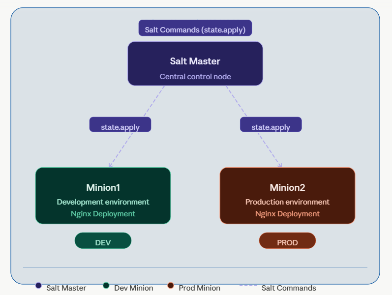
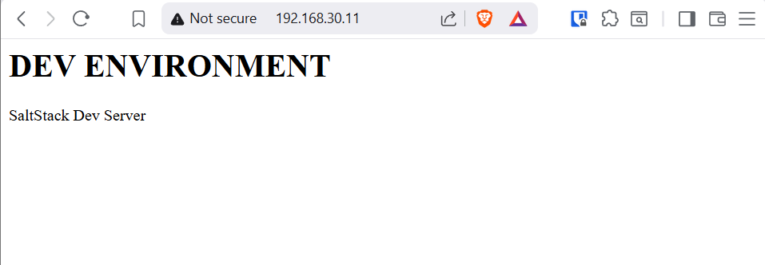
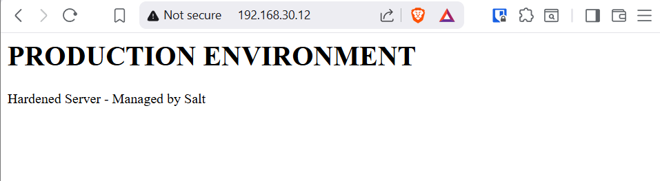

# SaltStack Automation Platform

Multi-node infrastructure automation using SaltStack with environment-based configuration (Development vs Production).

---

## Architecture



---

## Live Demo

### Development Environment


### Production Environment


---

## Skills Demonstrated

- Infrastructure Automation using SaltStack
- Configuration Management (Idempotent States)
- Role-Based Configuration using Grains
- Environment Segmentation (Dev vs Production)
- Linux System Administration (Ubuntu)
- Troubleshooting Real-World Issues:
  - Salt key authentication conflicts
  - Resource constraints (memory, swap)
  - Network configuration issues

---

## Project Highlights

- Built a centralized Salt Master controlling multiple nodes
- Automated Nginx deployment across distributed servers
- Implemented environment-specific configurations using Salt grains
- Stabilized system under resource constraints using swap memory
- Designed a scalable and reusable automation structure

---

## Quick Start

```bash
vagrant up
vagrant ssh master
sudo salt '*' test.ping
sudo salt '*' state.apply

## Author
Joey Akomeah - Platform & DevOps Engineer